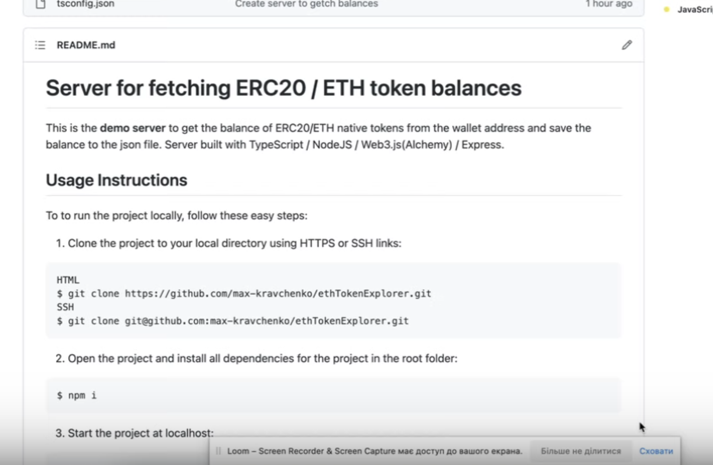

# Server for fetching ERC20 / ETH token balances

This is the **demo server** to get the balance of ERC20/ETH native tokens from the wallet address and save the balance to the json file. Server built with TypeScript / NodeJS / Web3.js(Alchemy) / Express.

## Video demo
[](https://www.loom.com/share/ddc7c12551c6461597f925780a73e9f0)

## Usage Instructions

To to run the project locally, follow these easy steps:

1. Clone the project to your local directory using HTTPS or SSH links:
```sh
HTML
$ git clone https://github.com/max-kravchenko/ethTokenExplorer.git
SSH
$ git clone git@github.com:max-kravchenko/ethTokenExplorer.git
```

2. Open the project and install all dependencies for the project in the root folder:
```
$ npm i
```
3. Start the project at localhost:
```
$ npm start
```
4. The localhost:3000 with default wallet address will open and demonstrate the balances. You can change the address to view different wallets.
```
Example: http://localhost:3000/0xA145ac099E3d2e9781C9c848249E2e6b256b030D
```
5. Simultaneously the job to write balance to file is running saving balance info to ./balance.json. To change the adress of wallet, modify the ADDRESS variable in .env file.
</br>

5. Enjoy your time and happy coding!
